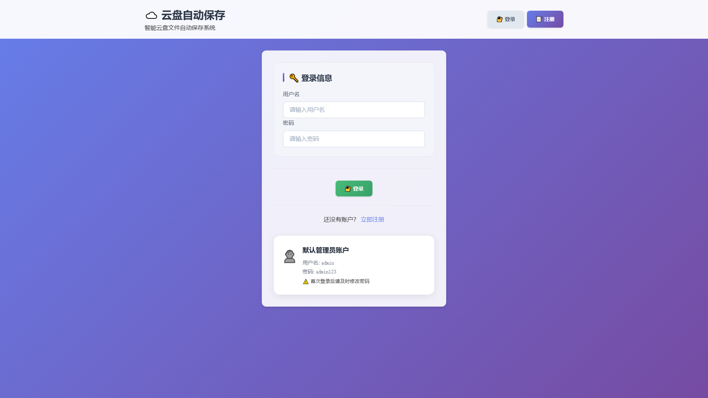
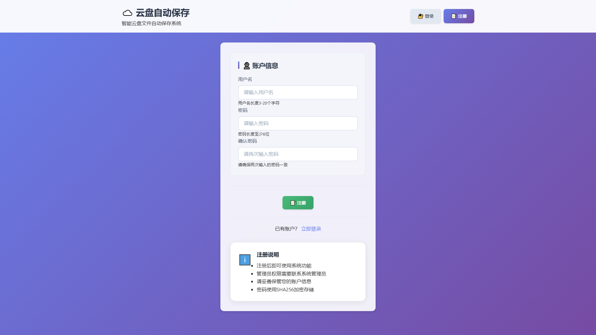
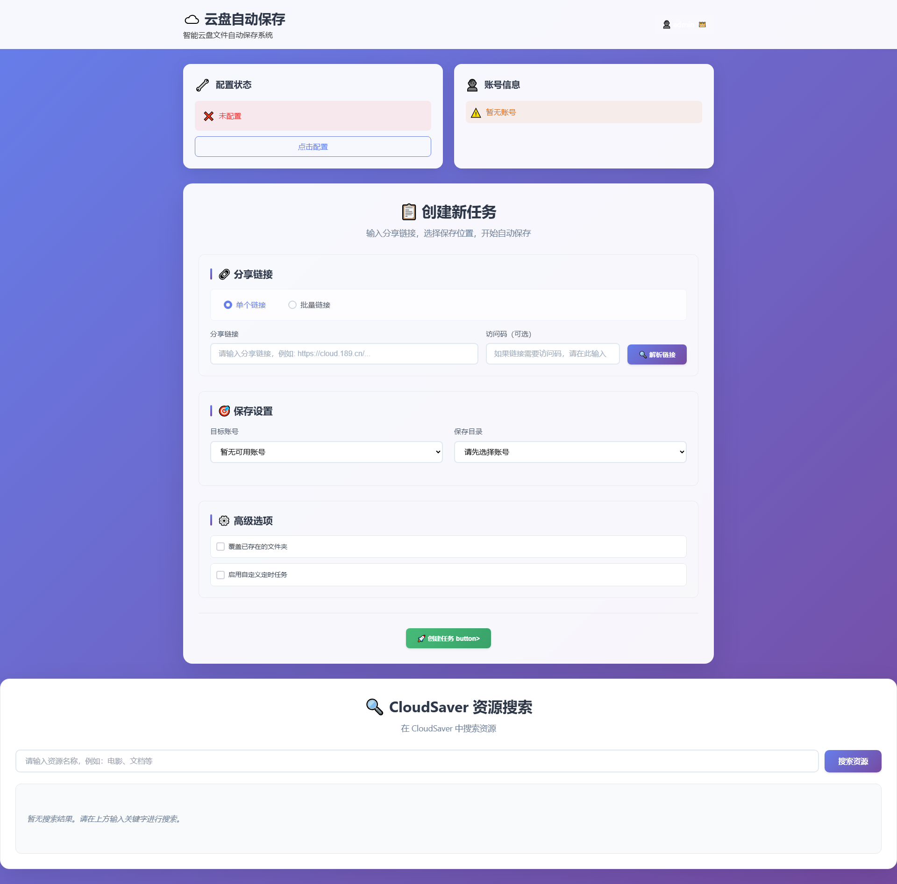
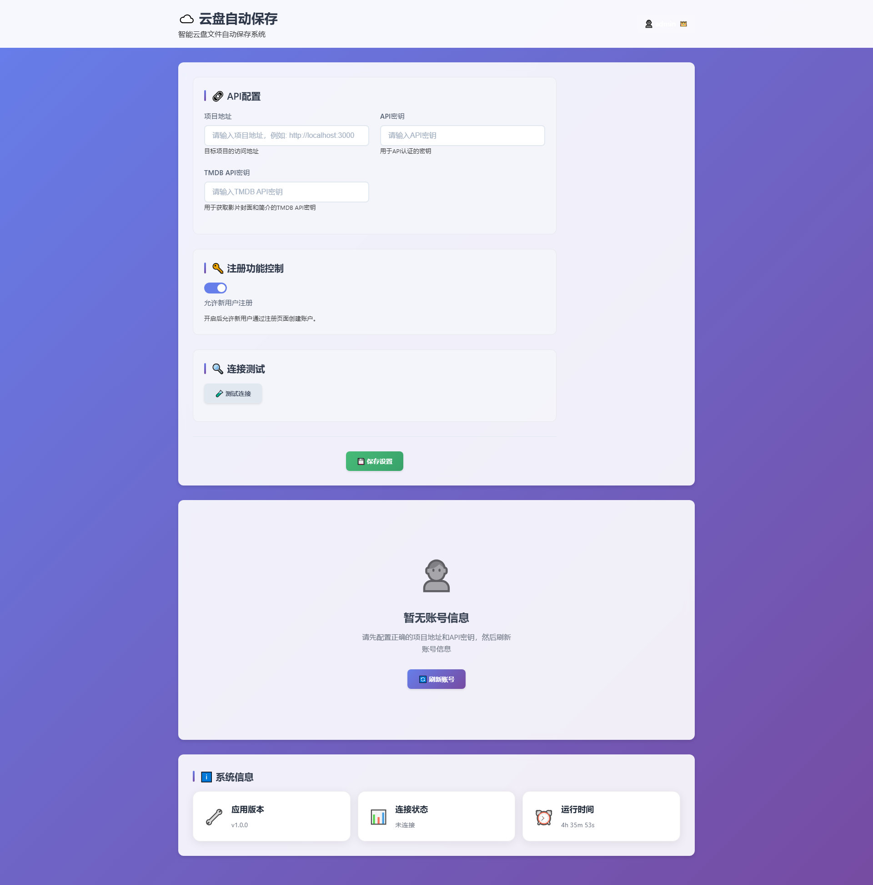
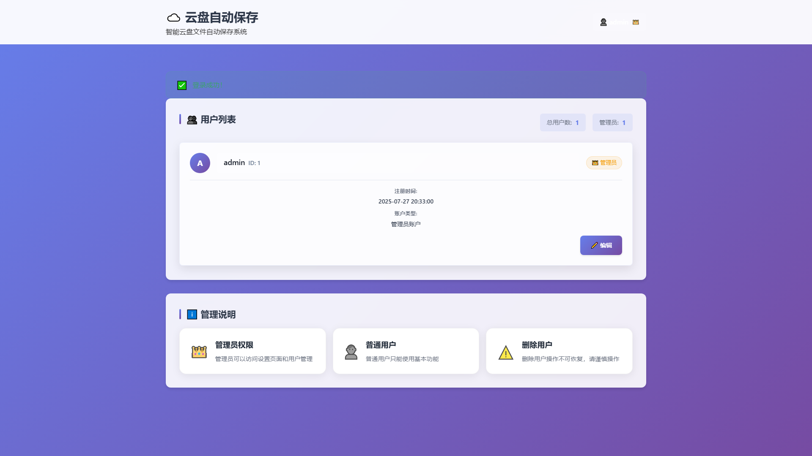
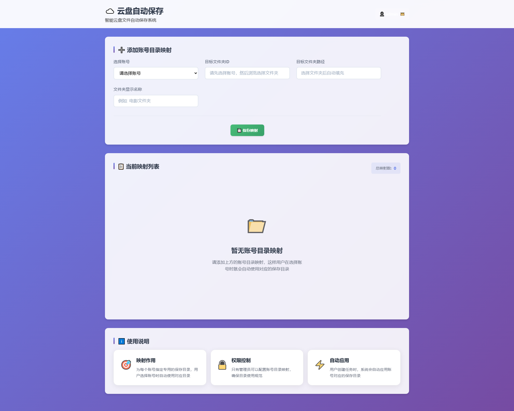
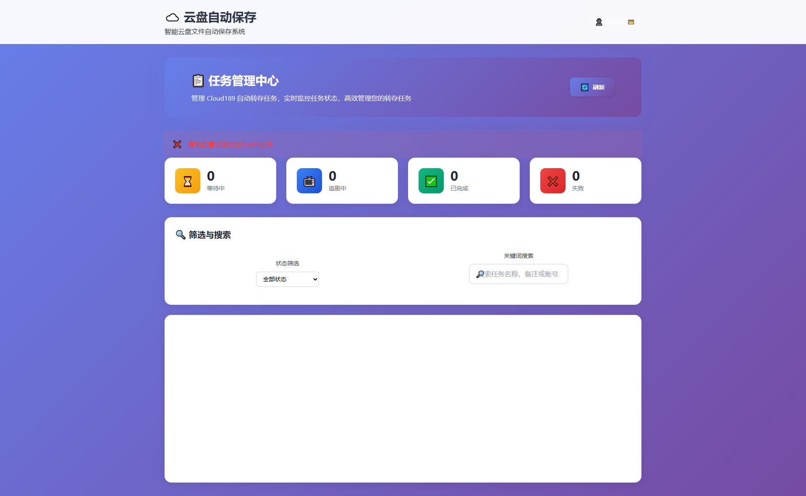
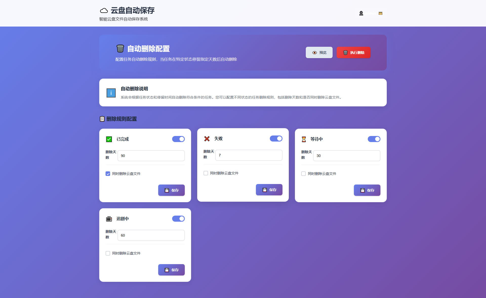

# ☁️ 云盘自动保存管理系统 (TyCloud)

一个基于 Flask 的智能云盘文件自动保存管理系统，专为天翼云盘用户设计，提供便捷的分享链接转存、任务管理、用户权限控制等功能。

## 📋 项目概述

TyCloud 是一个现代化的 Web 应用，旨在简化云盘文件的管理流程。通过直观的用户界面和强大的后台功能，用户可以轻松管理天翼云盘的分享链接转存任务，实现自动化文件管理。

**本项目基于 [cloud189-auto-save](https://github.com/1307super/cloud189-auto-save) 项目的 API 接口开发，作为其 Web 管理界面的补充和扩展。**

### 🔗 与 cloud189-auto-save 的关系

TyCloud 是 [cloud189-auto-save](https://github.com/1307super/cloud189-auto-save) 项目的 Web 管理界面扩展，主要特点：

- **API 集成**: 完全基于 cloud189-auto-save 的 RESTful API 接口
- **功能增强**: 提供更友好的 Web 界面和用户管理功能
- **权限控制**: 增加多用户权限管理系统
- **界面优化**: 现代化的响应式 Web 界面设计
- **功能扩展**: 集成 TMDB 影片信息、自动清理等额外功能

### 📋 前置要求

使用 TyCloud 前，需要先部署 [cloud189-auto-save](https://github.com/1307super/cloud189-auto-save) 项目：

1. 按照 [cloud189-auto-save 官方文档](https://github.com/1307super/cloud189-auto-save) 部署项目
2. 获取项目的访问地址和 API 密钥
3. 在 TyCloud 中配置相关连接信息

## ✨ 主要功能特性

### 🔐 用户权限管理
- **多用户支持**: 支持多个用户同时使用系统
- **角色权限控制**: 管理员和普通用户权限分离
- **注册控制**: 管理员可控制是否允许新用户注册
- **安全认证**: 基于 Session 的用户认证机制
- **默认管理员**: 系统初始化时自动创建管理员账户

### 📁 云盘任务管理
- **分享链接转存**: 支持天翼云盘分享链接的批量转存
- **批量任务创建**: 支持多个分享链接同时创建任务
- **任务状态监控**: 实时监控任务执行状态（等待中、追剧中、已完成、失败）
- **任务筛选搜索**: 按状态和关键词筛选任务
- **任务删除**: 支持单个和批量删除任务
- **定时任务**: 支持 Cron 表达式配置定时任务

### 🎯 智能目录管理
- **账号目录映射**: 为不同账号配置默认保存目录
- **目录树浏览**: 可视化浏览云盘目录结构
- **常用目录**: 快速访问常用目录
- **目录选择**: 支持选择特定目录进行转存

### 🗑️ 自动清理功能
- **智能清理**: 根据任务状态自动清理过期任务
- **可配置策略**: 支持为不同状态的任务配置不同的清理策略
- **预览功能**: 清理前可预览将要删除的任务
- **定时执行**: 支持定时自动执行清理任务
- **选择性删除**: 可选择是否同时删除云盘中的文件

### 🎬 媒体资源管理
- **TMDB 集成**: 集成 TMDB API 获取影片信息
- **资源搜索**: 支持 CloudSaver 资源搜索功能
- **封面显示**: 自动获取并显示影片封面
- **简介信息**: 显示影片简介和上映日期

### ⚙️ 系统配置管理
- **API 配置**: 配置 cloud189-auto-save 项目地址和 API 密钥
- **TMDB 配置**: 配置 TMDB API 密钥用于获取影片信息
- **连接测试**: 实时测试 cloud189-auto-save API 连接状态
- **账号管理**: 查看和管理云盘账号信息

### 🎨 现代化界面
- **响应式设计**: 适配不同屏幕尺寸
- **直观导航**: 清晰的导航结构和用户友好的界面
- **实时反馈**: 操作结果实时反馈
- **状态指示**: 清晰的状态图标和文字说明

## 🏗️ 技术架构

### 后端技术栈
- **Flask**: Python Web 框架
- **SQLite**: 轻量级数据库
- **Requests**: HTTP 请求库
- **Hashlib**: 密码加密
- **Threading**: 多线程支持

### 前端技术栈
- **HTML5**: 语义化标记
- **CSS3**: 现代化样式
- **JavaScript**: 交互功能
- **响应式设计**: 移动端适配

### 数据库设计
- **用户表 (users)**: 存储用户信息和权限
- **设置表 (settings)**: 存储系统配置
- **账号目录映射表 (account_directories)**: 存储账号与目录的映射关系
- **自动删除配置表 (auto_delete_config)**: 存储清理策略配置

## 🚀 快速开始

### 环境要求
- Python 3.7+
- pip 包管理器
- 已部署的 [cloud189-auto-save](https://github.com/1307super/cloud189-auto-save) 项目

### 安装步骤

1. **部署 cloud189-auto-save**
   ```bash
   # 首先按照官方文档部署 cloud189-auto-save 项目
   # 参考: https://github.com/1307super/cloud189-auto-save
   ```

2. **克隆 TyCloud 项目**
   ```bash
   git clone <repository-url>
   cd tycloud
   ```

3. **安装依赖**
   ```bash
   pip install -r requirements.txt
   ```

4. **运行应用**
   ```bash
   python app/app.py
   ```

5. **访问系统**
   打开浏览器访问 `http://localhost:5000`

6. **配置连接**
   - 使用默认管理员账户登录 (admin/admin123)
   - 进入"系统设置"页面
   - 配置 cloud189-auto-save 项目地址和 API 密钥
   - 测试连接确保配置正确

### Docker 部署

1. **构建镜像**
   ```bash
   docker build -t tycloud .
   ```

2. **运行容器**
   ```bash
   docker run -p 5000:5000 tycloud
   ```

## 📖 使用指南

### 首次使用

1. **管理员登录**
   - 默认管理员账户: `admin`
   - 默认密码: `admin123`
   - 首次登录后请及时修改密码

2. **系统配置**
   - 进入"系统设置"页面
   - 配置 cloud189-auto-save 项目地址和 API 密钥
   - 测试连接确保配置正确

3. **账号目录映射**（可选）
   - 为不同账号配置默认保存目录
   - 简化后续任务创建流程

### 创建转存任务

1. **单个任务创建**
   - 在首页输入分享链接
   - 选择目标账号和保存目录
   - 配置任务参数（覆盖文件夹、定时任务等）
   - 点击创建任务

2. **批量任务创建**
   - 在批量链接框中输入多个分享链接
   - 每行一个链接，支持访问码
   - 统一配置任务参数
   - 批量创建任务

### 任务管理

1. **查看任务状态**
   - 进入"任务管理"页面
   - 查看所有任务的实时状态
   - 使用筛选功能查找特定任务

2. **删除任务**
   - 选择单个或多个任务
   - 选择是否同时删除云盘文件
   - 确认删除操作

### 自动清理配置

1. **配置清理策略**
   - 进入"自动删除配置"页面
   - 为不同状态的任务设置清理策略
   - 配置清理间隔和是否删除云盘文件

2. **预览和执行**
   - 预览将要清理的任务
   - 手动执行清理或启用定时清理

## 🔧 配置说明

### 环境变量
- `FLASK_APP`: Flask 应用入口文件
- `FLASK_ENV`: 运行环境（development/production）

### 数据库配置
- 数据库文件位置: `instance/settings.db`
- 自动初始化: 首次运行时自动创建数据库目录和表结构

### API 配置
- **项目地址**: cloud189-auto-save 项目的访问地址
- **API 密钥**: cloud189-auto-save 项目的 API 认证密钥
- **TMDB API 密钥**: 用于获取影片信息的 TMDB API 密钥

## 📸 界面预览

### 🔐 用户认证

#### 登录页面


#### 注册页面


### 🏠 主要功能

#### 首页


#### 系统设置


#### 用户管理


#### 账号目录映射


#### 任务管理


#### 自动删除配置


## 📁 项目结构

```
tycloud/
├── app/                    # 应用主目录
│   ├── app.py             # 主应用文件
│   ├── static/            # 静态资源
│   │   ├── style.css      # 主样式文件
│   │   └── checkbox-fix.css # 复选框样式
│   └── templates/         # HTML 模板
│       ├── index.html     # 首页
│       ├── login.html     # 登录页
│       ├── register.html  # 注册页
│       ├── settings.html  # 设置页
│       ├── users.html     # 用户管理页
│       ├── tasks.html     # 任务管理页
│       └── ...            # 其他模板文件
├── instance/              # 实例数据目录
│   └── settings.db        # SQLite 数据库文件
├── cloud189-auto-save/    # cloud189-auto-save 项目目录（可选）
├── cloud189-auto-save.wiki/ # cloud189-auto-save 项目文档
├── requirements.txt       # Python 依赖
├── Dockerfile            # Docker 配置
└── README.md             # 项目说明
```

## 🔒 安全特性

- **密码加密**: 使用 SHA256 加密存储用户密码
- **Session 管理**: 安全的用户会话管理
- **权限控制**: 基于角色的访问控制
- **输入验证**: 严格的输入数据验证
- **SQL 注入防护**: 使用参数化查询防止 SQL 注入

## 🛠️ 开发指南

### 代码结构
- **路由管理**: 清晰的路由组织结构
- **函数分离**: 功能模块化，便于维护
- **错误处理**: 完善的异常处理机制
- **日志记录**: 详细的日志记录

### 扩展功能
- **插件系统**: 支持功能模块扩展
- **API 接口**: 提供 RESTful API 接口
- **配置管理**: 灵活的配置管理系统

## 🤝 贡献指南

1. Fork 项目
2. 创建功能分支 (`git checkout -b feature/AmazingFeature`)
3. 提交更改 (`git commit -m 'Add some AmazingFeature'`)
4. 推送到分支 (`git push origin feature/AmazingFeature`)
5. 打开 Pull Request

## 📄 许可证

本项目采用 MIT 许可证 - 查看 [LICENSE](LICENSE) 文件了解详情

## 🙏 致谢

- [Flask](https://flask.palletsprojects.com/) - Python Web 框架
- [cloud189-auto-save](https://github.com/1307super/cloud189-auto-save) - 天翼云盘自动转存系统，本项目基于其 API 接口开发
- [TMDB](https://www.themoviedb.org/) - 电影数据库 API

## 📞 联系方式

如有问题或建议，请通过以下方式联系：

- 项目 Issues: [GitHub Issues](https://github.com/.../issues)
- 邮箱: [your-email@example.com]

---

**注意**: 本项目仅供学习和个人使用，请遵守相关服务条款和法律法规。 